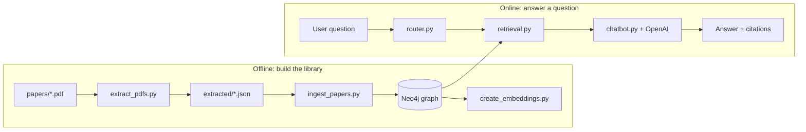

# Devreotes Lab Research Chatbot — Architecture & Usage (Plain-English Guide)

This document explains **what the system does**, **how the pieces connect**, **what lives in the graph database**, **which technologies are used and why**, and **how to run the project**. It is written so non-specialists can follow along; technical terms are introduced with everyday analogies.

---

## 1. What problem does this solve?

Imagine a **stack of PDF research papers** from Prof. Peter Devreotes’ lab. A user asks a question in natural language, for example: *“Which papers talk about PTEN?”* or *“What are the most-mentioned genes across the corpus?”*

The system must:

1. **Stay grounded** — answers should come from *those papers*, not from the model’s general internet-like knowledge.
2. **Point to evidence** — answers cite numbered passages (chunks) so readers can verify.
3. **Use the right “lens”** — sometimes the best answer is *semantic search*, sometimes *filter by gene or author*, sometimes a *simple statistic* over the graph.

This project implements **GraphRAG**: a **graph** (Neo4j) stores papers, chunks, genes, authors, and optional entities; **retrieval** finds relevant text; a **large language model (LLM)** writes the final answer using only what was retrieved.

---

## 2. Big picture: flow from PDF to answer

Think of the pipeline like a **library with a smart index**:

| Stage | Plain analogy |
|--------|----------------|
| **PDFs on disk** | Books on a shelf (`papers/`) |
| **Text extraction** | Typing each book into plain text (`extracted/*.json`) |
| **Neo4j graph** | Card catalog + cross-references: which paper, which chunk, which gene |
| **Embeddings** | “Semantic sticky notes” on each chunk so *similar meaning* can be found by vector search |
| **Question → route** | Librarian decides: *gene shelf*, *author shelf*, *statistics*, or *general similarity* |
| **LLM** | A careful writer who may only quote from the pages you slid across the desk |

---

## 3. Step-by-step: what runs when (offline vs online)

### A. Offline — “building the library” (run once, then again when you change rules or papers)

1. **HGNC gene dictionary** (`run_download_hgnc.py`)  
   - **Layman:** A standard **phone book for human gene symbols** (official symbols and aliases).  
   - **Why:** So when text says “PTEN” or an alias, we link to **one** canonical gene node instead of guessing.

2. **Extract PDFs** (`run_extract_pdfs.py`)  
   - Reads each PDF, pulls text and best-effort metadata (title, DOI, year, journal hints, PDF author/subject when present).  
   - **Layman:** OCR-free **photocopying the words** into JSON files under `extracted/`.

3. **Neo4j schema** (`run_setup_schema.py`)  
   - Creates **unique IDs** and **indexes** (including a **vector index** on chunk embeddings).  
   - **Layman:** Library **rules** (“every chunk has one ID”) and a **fast index** for search.

4. **Ingest** (`run_ingest_papers.py`)  
   - Creates **Paper**, **Chunk**, links genes and authors, optional **Claim** snippets, and **Entity** nodes for genes/authors as used in the original design.  
   - **Layman:** **Filing cards**: this paper has these paragraphs; these paragraphs mention these genes.

5. **Embeddings** (`run_create_embeddings.py`)  
   - Computes a **vector** (list of numbers) per chunk using a biomedical sentence model.  
   - **Layman:** Each paragraph gets a **fingerprint of meaning**, so “chemotaxis” and “cell movement” can match even if words differ.

6. **Optional: LLM graph enrichment** (`run_llm_graph_extract.py`)  
   - Calls a small/cheap model to label **topics, pathways, methods**, etc., and optional relationships.  
   - **Layman:** A **second pass of highlighting** with structured labels—not required for basic Q&A.

### B. Online — “asking the library a question”

1. User submits a question (Gradio `app.py` or Nuxt UI → Python **bridge** → `chatbot.py`).
2. **Router** (`router.py`) classifies: *themes / author / gene / semantic*.
3. **Retrieval** (`retrieval.py`) runs vector search and/or Cypher filters (e.g., only chunks from papers that *mention* gene X).
4. **Chatbot** (`chatbot.py`) builds a prompt: system rules + numbered passages + user question; the **LLM** streams or returns an answer with `[1]`, `[2]`-style citations.

---

## 4. Graph: main nodes and relationships

Neo4j stores **nodes** (things) and **relationships** (edges). Below is the **mental model** this project uses.

### Nodes (the “nouns”)

| Label | Plain meaning | Typical properties |
|--------|----------------|----------------------|
| **Paper** | One publication in the corpus | `paper_id`, `title`, `filename`, optional `doi`, `year`, `journal`, PDF metadata hints |
| **Chunk** | A slice of text from a paper (searchable unit) | `chunk_id`, `text`, `chunk_index`, **embedding** (vector) |
| **Gene** | A human gene from HGNC | `hgnc_id`, `official_symbol` |
| **Author** | A person (as extracted) | `author_key`, `name` |
| **Entity** | Generic tagged concept (gene/topic/author as entity, etc.) | `entity_key`, `type`, `name` |
| **Claim** | A short extracted sentence-like unit (for grounding) | `claim_id`, `text` |

### Relationships (the “verbs”)

| Pattern | Plain meaning |
|---------|----------------|
| `(:Paper)-[:HAS_CHUNK]->(:Chunk)` | This paper **contains** this paragraph. |
| `(:Author)-[:AUTHORED]->(:Paper)` | This person **wrote** this paper. |
| `(:Paper)-[:MENTIONS]->(:Gene)` | This paper **mentions** this gene (corpus-level link). |
| `(:Chunk)-[:MENTIONS]->(:Entity)` | This paragraph **mentions** this entity (chunk-level). |
| `(:Paper)-[:HAS_TOPIC]->(:Entity)` | Paper-level **topic** link (e.g., for “Topic” entities). |
| `(:Entity)-[:RELATED_TO]->(:Entity)` | Optional **semantic link** between entities (Phase 5). |
| `(:Claim)-[:SUPPORTS]->(:Chunk)` | A short claim **supported by** this chunk. |

**Layman analogy:**  
- **Paper** = book. **Chunk** = page or paragraph. **Gene/Author** = index entries. **Embedding** = invisible tag that helps “find similar paragraphs.”

---

## 5. Tech stack — what each part is and why it was chosen

| Piece | Role | Why it fits this project |
|--------|------|---------------------------|
| **Neo4j** | Graph database | Papers, chunks, and “mentions” are naturally **networks**. Cypher can **filter by gene/author** and combine with vector search. |
| **PyMuPDF (`fitz`)** | PDF text extraction | Fast, local, no cloud OCR required for text-based PDFs. |
| **scispaCy + `en_core_sci_lg`** | Biomedical NLP | Good at spotting **gene-like spans** in running text during ingest. |
| **HGNC JSON** | Gene normalization | **Community standard** for human gene symbols and aliases—reduces duplicate or wrong gene nodes. |
| **SentenceTransformers + PubMed-tuned model** | Chunk embeddings | **Same embedding space** for question and chunks → meaningful cosine / vector index similarity in biomedicine. |
| **Neo4j vector index** | Approximate nearest-neighbor search | Lets you ask “what passages are *semantically* closest to my question?” at scale. |
| **LangChain + OpenAI (`gpt-4o`)** | Answer generation | Strong instruction-following for **citations** and **refusal** when context is weak. |
| **Gradio (`app.py`)** | Quick local UI | Minimal setup for demos and debugging without a JS build. |
| **Nuxt + AI SDK + Nuxt UI** | Production-style chat UI | **Streaming** answers, modern UX, CSRF-aware API routes. |
| **Python bridge (`devreotes_bridge.py`)** | Subprocess from Node | Reuses the **same** `chatbot.py` logic for the Nuxt app without rewriting retrieval in TypeScript. |

Nothing here is “magic”: each tool solves one layer—**storage**, **text**, **biology naming**, **meaning vectors**, **routing**, **generation**, **UI**.

---

## 6. The “organs” of the system (how they work together)

### Router (`router.py`)

- **Job:** Guess *what kind of question* this is.  
- **Layman:** The **receptionist** who sends you to “gene desk,” “author desk,” “statistics desk,” or “general reading room.”  
- **Why it matters:** Asking “which kinases are *most mentioned*?” should not be treated the same as “what does *PTEN* do in chemotaxis?”—different desks, different tools.

### Retrieval (`retrieval.py`)

- **Job:** Return ranked **chunks** (and sometimes aggregate **gene counts**).  
- **Layman:** The **librarian** who pulls books off the shelf *and* photocopies the right pages.  
- **Extras:** Per-paper diversity (not ten chunks from one paper), optional rerank, optional **graph expansion** (extra chunks in the same paper that share extracted entities).

### Chatbot (`chatbot.py`)

- **Job:** If confidence is too low, **say so**; otherwise assemble context and call the LLM.  
- **Layman:** The **editor**: you only get an article built from supplied quotes, with citation numbers.

### Optional Phase 5 (`llm_chunk_extract.py`)

- **Job:** Add richer **Entity** nodes and relationships from LLM JSON.  
- **Layman:** Optional **second round of indexing** for topics and links—not required for baseline Q&A.

---

## 7. Two ways to use the UI

| Interface | Command | Audience |
|-----------|-----------|----------|
| **Gradio** | `python app.py` | Fast local demo, single-user. |
| **Nuxt** | `cd nuxt-chat-interface && pnpm dev` | Richer chat UI, **streaming** responses; set `DEVREOTES_PYTHON` to your venv’s `python` if needed. |

Both ultimately call the same Python **brain** (`backend/app/chatbot.py`) for answers.

---

## 8. Usage checklist (short)

1. Copy `.env.example` → `.env` and set **Neo4j** and **OpenAI** keys.  
2. Run scripts in order: **HGNC → extract → schema → ingest → embeddings** → *(optional)* **LLM extract**.  
3. Start **Gradio** or **Nuxt** as above.

Full command list and environment table: see **`structure.md`** in this folder.

---

## 9. End-to-end example (layman walkthrough)

**Question:** *“What does the corpus say about PTEN?”*

1. **Router** notices “PTEN” and gene-related language → **gene route** (if PTEN resolves in HGNC).  
2. **Retrieval** finds chunks from papers whose graph says they **mention PTEN**, ranked by **vector similarity** to the question.  
3. **Chatbot** builds a prompt: numbered excerpts only.  
4. **LLM** answers and cites `[1]`, `[2]` matching those excerpts.  
5. If nothing clears the minimum similarity score, the system **abstains** instead of inventing facts—by design.

**Question:** *“Which genes appear in the most papers?”*

1. **Router** sends this toward the **themes** path (gene-mention **counts** over the graph).  
2. **Retrieval** returns a **table-like summary** (genes × paper counts), not long prose from one paper.  
3. The LLM is instructed **not** to invent qualitative “themes” beyond those counts.

---

## 10. Design principles (why things are the way they are)

1. **Corpus-grounded:** The LLM is a **writer**, not the **source of truth**—the graph and chunks are.  
2. **Explainable:** Chunks and scores can be inspected; citations tie answers to **specific text**.  
3. **Biomedical realism:** HGNC + scispaCy + PubMed-flavored embeddings match how **genes and papers** are discussed.  
4. **Pragmatic graph:** Not every possible ontology is modeled—only what helps **search**, **filters**, and **stats** for this capstone scope.

---

## 11. Key additions since the basic router + Gradio layout

This section summarizes **agentic RAG**, the **Nuxt API**, **retrieval / decision trace**, **streaming**, and **UI** pieces that extend the original “router → retrieval → chatbot” picture. Full **environment variable** tables and runbook details: **`structure.md`** (under `chatBot/resources/DevreotesLabResearchChatbot/`).

### 11.1 Two RAG modes: router (default) vs agent

- **`DEVREOTES_RAG_MODE=router` (default)** — Same mental model as §6: `router.py` picks a **single** route (`themes` / `gene` / `author` / `semantic`), `retrieval.py` runs that path once, then `chatbot.py` builds one context block and calls the LLM.
- **`DEVREOTES_RAG_MODE=agent`** — The model can call **multiple retrieval tools** over several steps (`semantic_search`, `gene_literature_search`, author/themes tools in `backend/app/agent_tools.py` via `run_evidence_agent`). Evidence is merged and deduplicated; the final answer is still **corpus-grounded** with citations. Optional cap: **`DEVREOTES_AGENT_MAX_STEPS`** (see `structure.md`).

**Layman:** Router mode is *one trip to the library*. Agent mode is *the librarian may go back to different shelves several times* before writing the answer.

### 11.2 Nuxt ↔ Python: bridge vs HTTP API

The Nuxt app does **not** reimplement retrieval in TypeScript. It gets answers by either:

1. **Subprocess bridge** — `nuxt-chat-interface/server/python/devreotes_bridge.py` runs the same `chatbot.py` streaming entrypoint (`iter_answer_ndjson`), printing **NDJSON** lines to stdout. Configure the interpreter with **`DEVREOTES_PYTHON`** if needed.
2. **HTTP API (optional)** — Run **`uvicorn backend.app.api_app:app`** (see `structure.md`), set **`DEVREOTES_API_URL`** in Nuxt’s env so Nitro calls **`POST /chat/stream`** instead of spawning Python each time. Shared secret optional: **`DEVREOTES_API_SECRET`** / header **`X-Devreotes-Key`**.

The UI records which path was used in the trace as **`backend`: `bridge` | `http`**.

### 11.3 Streaming protocol (NDJSON + AI SDK UI stream)

- The Python side yields lines like **`{"type":"delta","text":"..."}`** and a final **`{"type":"finish","result":{...}}`** (see `chatbot.py` and `server/utils/devreotesNdjson.ts` in the Nuxt app).
- The Nuxt route **`POST /api/devreotes/chats/[id]`** turns that into an **AI SDK UI message stream** for the browser; the client **`consumeDevreotesUiSse`** reads SSE and appends text to the assistant message.

### 11.4 Retrieval / “decision” trace (audit payload)

Each finished turn can carry a structured **`devreotes_trace`** (JSON) alongside the assistant text, for transparency and debugging:

| Field (concept) | Role |
|-----------------|------|
| **`query_type` / `query_type_label`** | Internal route key vs human-readable label (e.g. “Gene-focused retrieval”, “Agent retrieval (tools)”). |
| **`routed_key`** | Gene symbol, author string, `themes`, etc., when applicable. |
| **`results_count`** | How many retrieved rows fed the answer (where applicable). |
| **`sources`** | Ordered list of source strings (e.g. title + chunk id) aligned with citation numbers **`[1]`**, **`[2]`**, … |
| **`retrieval_preview`** | Structured snapshot of retrieval rows (scores, routes, ids). |
| **`abstained` / `abstain_reason`** | When the system refuses to answer (e.g. below **`RAG_MIN_SCORE`**, no chunks). |
| **`tool_calls_log`** | In **agent** mode, a log of tool names/args for audit. |
| **`trace_version`** | Schema version for forward compatibility. |

In the chat UI, **`DevreotesTracePanel.vue`** shows a collapsible **“Retrieval trace”** under assistant messages. The same **`sources`** list drives **citation tooltips** in the rendered markdown (`injectCitationMarkdown` wraps `[n]` / list-line citations and maps indices to `sources`).

### 11.5 Citations in the UI

- The backend instructs the model to cite with **`[1]`**, **`[2]`**, … matching numbered passages. Agent prompts may also use **`[S1]`**-style tags when **gene statistics** and **chunk passages** appear in one context.
- The Nuxt layer injects **styled, hover/focus tooltips** (via `data-tooltip` + CSS) so reference markers are visually distinct and show the corresponding **source title/snippet**, not just bare numbers.

### 11.6 Persistence (Nuxt / Hub)

- Chat messages can be stored in the app database; assistant rows may include **`devreotes_trace`** (or snake_case **`devreotes_trace`**) so traces survive reloads. See server schema/migrations under `nuxt-chat-interface/server/db/`.

### 11.7 Quick index (agent, API, trace, streaming)

Paths below are relative to **`chatBot/resources/DevreotesLabResearchChatbot/`** (the Nuxt app lives in `nuxt-chat-interface/` there).

| Topic | Location |
|--------|-----------|
| RAG mode switch + streaming Q&A | `backend/app/chatbot.py` (`_rag_mode`, agent path, `iter_answer_ndjson`) |
| Agent tools | `backend/app/agent_tools.py`, `run_evidence_agent` |
| FastAPI stream (optional) | `backend/app/api_app.py` (per `structure.md`) |
| Nuxt Devreotes route + stream | `nuxt-chat-interface/server/api/devreotes/chats/[id].post.ts`, `server/utils/devreotesNdjson.ts` |
| Bridge subprocess | `nuxt-chat-interface/server/python/devreotes_bridge.py` |
| Trace types | `nuxt-chat-interface/app/types/devreotes-trace.ts`, `server/types/devreotes-trace.ts` |
| Trace UI | `nuxt-chat-interface/app/components/DevreotesTracePanel.vue` |
| Client stream consumer | `nuxt-chat-interface/app/utils/devreotesSse.ts` |
| Chat page (trace + citations) | `nuxt-chat-interface/app/pages/chat/[id].vue` |
| Citation injection | `nuxt-chat-interface/app/utils/injectCitationMarkdown.ts`, `app/assets/css/main.css` (`.devreotes-cite`) |

---

## 12. Where to look in the repo

| Topic | Location |
|--------|----------|
| Extract PDFs | `backend/app/extract_pdfs.py` |
| Ingest / graph writes | `backend/app/ingest_papers.py` |
| Schema / indexes | `backend/app/setup_schema.py` |
| Embeddings | `backend/app/create_embeddings.py` |
| Search & routes | `backend/app/retrieval.py`, `backend/app/router.py` |
| Q&A + streaming path | `backend/app/chatbot.py` |
| Nuxt → Python | `nuxt-chat-interface/server/python/devreotes_bridge.py` |
| Env template | `.env.example` |
| Run order | `structure.md` |

For **agent mode, HTTP API, trace panel, NDJSON streaming, and citation UI**, see **§11** and especially **§11.7**. When browsing from the **neo4j** repo root, prefix paths with `chatBot/resources/DevreotesLabResearchChatbot/`.

---

*This guide reflects the Devreotes Lab Research Chatbot layout under `backend/app/` and the Nuxt bridge. If you change ingest rules or schema, re-run the offline pipeline so the database matches the code.*
