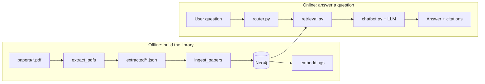
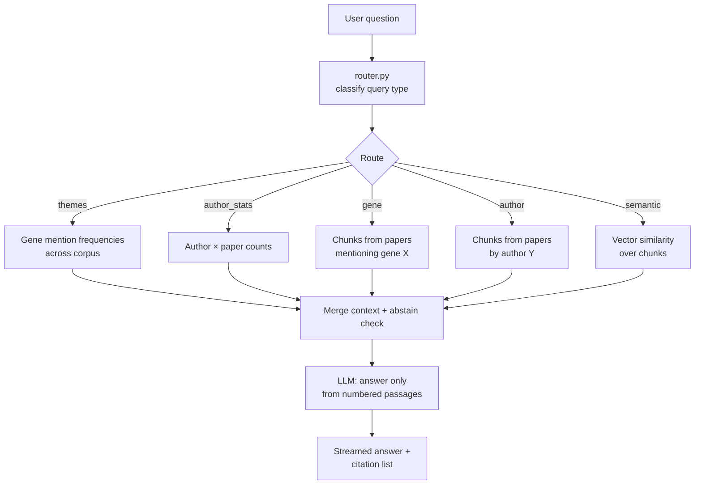
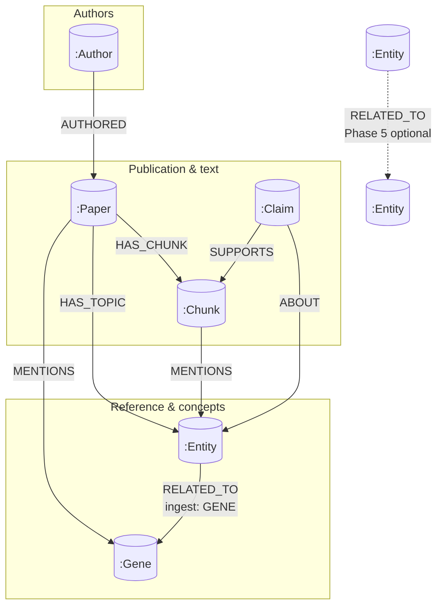

## Full system architecture (runtime)

The **browser** does not talk to Neo4j directly. **Nuxt** (Nitro) streams the answer; **Python** runs the same `chatbot.py` logic via a **subprocess bridge** (NDJSON) or an optional **FastAPI** HTTP backend.

```mermaid
flowchart TB
  subgraph offline["Offline: build corpus"]
    PDF["papers/ → extract → extracted/"]
    PIPE["schema → ingest → embeddings"]
    PDF --> PIPE
  end

  NEO[("Neo4j\n(graph + vector index)")]
  PIPE --> NEO

  subgraph clients["Clients"]
    BR["Browser\n(Nuxt UI)"]
    GR["Gradio\napp.py"]
  end

  subgraph nuxt["Nuxt server (Nitro)"]
    API["POST /api/devreotes/chats/:id\n(SSE / AI SDK stream)"]
    APPDB[("App DB\nmessages, traces)"]
    BRG["devreotes_bridge.py\n(NDJSON stdout)"]
  end

  subgraph fastapi["Optional: DEVREOTES_API_URL"]
    FAPI["FastAPI\nPOST /chat/stream"]
  end

  subgraph core["Python backend (backend/app)"]
    CHAT["chatbot.py\n(router vs agent)"]
    ROUT["router.py"]
    AGT["agent_tools"]
    RETR["retrieval.py\nvector + Cypher"]
  end

  LLM["OpenAI API"]

  BR --> API
  API --> APPDB
  API --> BRG
  API -.->|optional| FAPI
  FAPI --> CHAT
  BRG --> CHAT
  GR --> CHAT
  CHAT --> ROUT
  CHAT --> AGT
  ROUT --> RETR
  AGT --> RETR
  RETR --> NEO
  CHAT --> LLM
```

## Question → answer (logical flow)


## Slide 9 — Example demo queries (by route)

| Goal | Example question |
|------|------------------|
| **Semantic** | “How does chemotaxis relate to cell polarity in these papers?” |
| **Gene** | “What do the papers say about **PTEN**?” |
| **Author** | “What passages discuss chemotaxis in papers by **Devreotes**?” |
| **Themes (gene counts)** | “Which **genes** are **most mentioned** across the corpus?” |
| **Author stats** | “**Which authors** appear on **more than one paper**?” |


**Router vs agent (`DEVREOTES_RAG_MODE`):**

- **router (default):** one route, one retrieval pass — predictable for demos.  
- **agent:** model may call multiple tools (`semantic_search`, `gene_literature_search`, …) before answering.

**Conversation behavior:** within a chat thread, Nuxt sends the last **10** turns (`messages`) plus a rolling `summary` to FastAPI; backend uses it for reference resolution while still citing retrieved corpus evidence.

---

## Conversational properties (thread scope)

| Property | Value / default | Notes |
|----------|------------------|-------|
| `messages` | Last `N` turns (`N=10`) | Sent by Nuxt to `POST /chat/stream` (FastAPI path) |
| `summary` | `chats.summary` (rolling) | Updated after each assistant response |
| Summary model | `openai/gpt-4o-mini` | Configurable via `DEVREOTES_SUMMARY_MODEL` |
| Max summary length | `1500` chars | `DEVREOTES_SUMMARY_MAX_CHARS` |

Bridge mode (`devreotes_bridge.py`) remains plain-question stdin and does not send structured history.

---

## Neo4j graph model (summary)

**Nodes:** `Paper`, `Chunk` (with **embedding** for vector index), `Gene` (HGNC), `Author`, optional `Entity`, `Claim`.



## Tech stack (elevator list)

| Layer | Choice | Why |
|-------|--------|-----|
| Graph + vectors | **Neo4j** | Papers and “mentions” are naturally a graph; native vector index on chunks |
| PDF text | **PyMuPDF** | Fast, local extraction |
| Gene names | **HGNC** + **scispaCy** | Canonical symbols, fewer duplicate nodes |
| Embeddings | **SentenceTransformers** (PubMed-tuned) | Same space for question vs chunk |
| Generation | **OpenAI** (via `chatbot.py`) | Strong instruction-following for citations |
| UI | **Nuxt + AI SDK** | Streaming, persistence, modern UX |

---